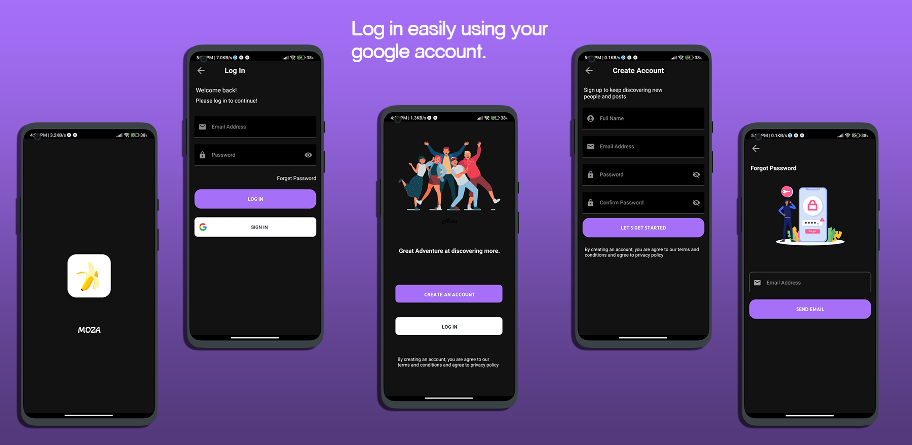
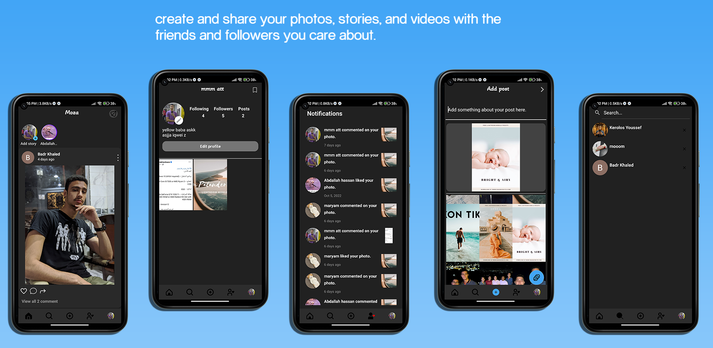
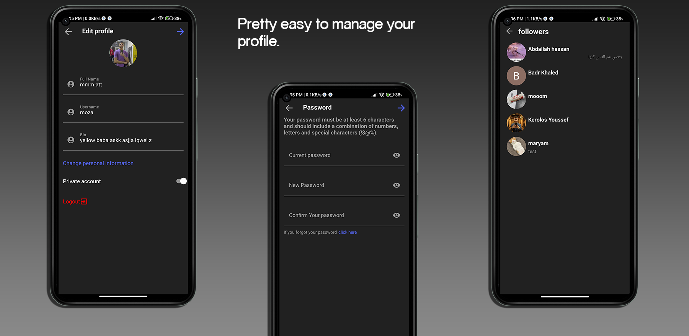
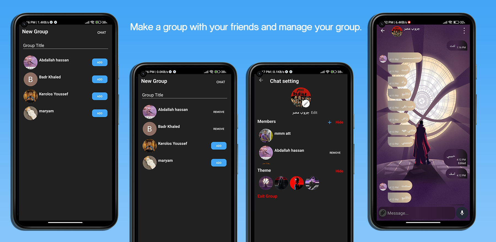
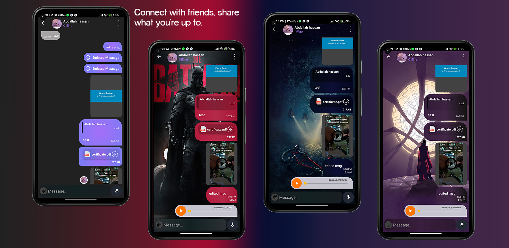
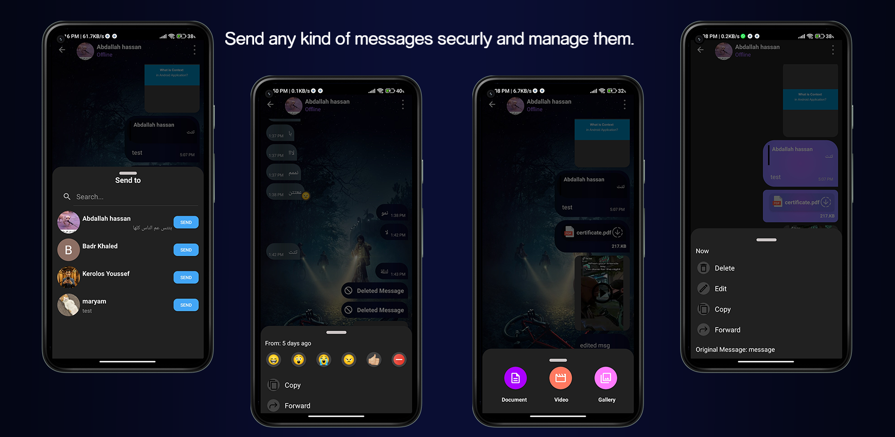
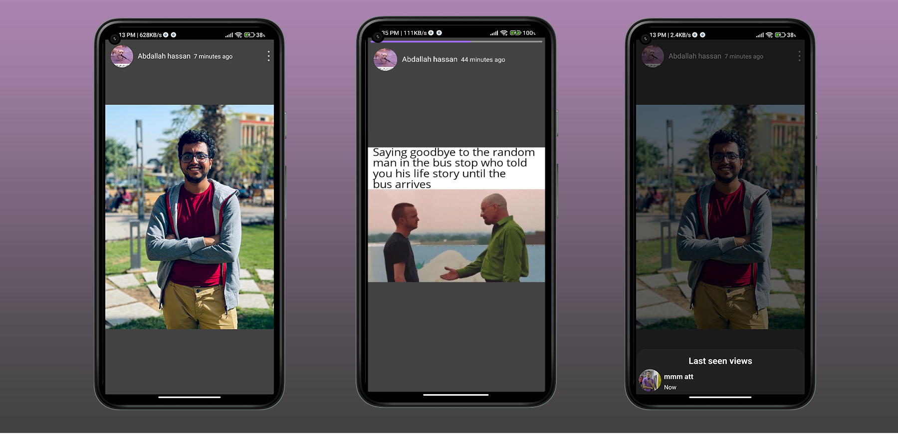

# Features
## Posts:
* user can create standard account or login with google.
* user can reset his pass using email.
* authentications on all the user inputs.
* user can crop and post a photo with caption.
* user can upload a story (photo - video) and it will be visible only for 24 hours.
* user can see all the views on his story with time.
* user can follow and chat other users also he can view the list of followers or following.
* user can save or hide any post from his following people posts.
* user can search for any user and have search history.
* user have notifications page that have any notification like if another user liked or commented on his photo.
* user can edit all his profile data and also can set his profile private or not.
* user have mobile notification for every message received or event happen.
## Chat:
* user can have one-to-one chat or a group chat.
* user can delete or hide any chat and also he can request from the second user to both delete the chat permanently and the second user will notify with that.
* user can send (text - video - photo - documents - voice chat) messages.
* user can save sent videos or photos on his device.
* user can reply on messages like whatsApp and he can delete the message ( before 24 hours from sending it).
* user can edit a textMessage once but the message will appear as edited and the original message can be viewed.
* user can forward any message and it will appear as forwarded.
* user can react with emoji on any message and can copy any text message. 
* user have a list of chat theme to select from it.
* for group chat it has the same functions like normal chat but the admin can add or remove members or change the group details.
* offline access to your chat.

# Screenshots:

# Technologies & Open-source libraries
* Kotlin mainly, Coroutines together with Flow.

* Firebase mainly used in this project:
	* Authentication		
	* Firestore
	* Storage
	* FCM
* Dependency injection (Dagger Hilt).
* Retrofit A type-safe HTTP client.
* [SDP](https://github.com/intuit/sdp) to support different screen sizes.
	* Architecture
		* MVVM (model view view-model).
		* reposittory pattern.
* Material design components

* JetPack:
	* Lifecycle
	* ViewModel
	* ViewBinding
	* Navigation Component
	* Palette
		
	* [Swipe-to-reply](https://github.com/izjumovfs/SwipeToReply) for whatsApp swipe function.
	* [Touch-Imageview](https://github.com/MikeOrtiz/TouchImageView) to zoom in photos.
	* [records-player](https://github.com/JagarYousef/ChatVoicePlayer) for a simple record player.
	* [voice-message-recorder](https://github.com/varunjohn/Audio-Recording-Animation) for a recoder layout like whatsApp.
	* [video-trimmer](https://github.com/a914-gowtham/android-video-trimmer) to trim video before uploading it.
	* [image-cropper](https://github.com/CanHub/Android-Image-Cropper) to crop image befor uploading it.
	* [Glide](https://github.com/bumptech/glide) very easy library to load images or thumnails.
	* [Dexter](https://github.com/Karumi/Dexter)	to ask for permissions.
	* [Circular-imageView](https://github.com/lopspower/CircularImageView) which support border on images.
	* [Alert_dialog](https://github.com/MarsadMaqsood/StylishDialogs) with animations.
	* [Instagram_progreeBar](https://github.com/GeniusRUS/MultiProgressBar).
	
	
